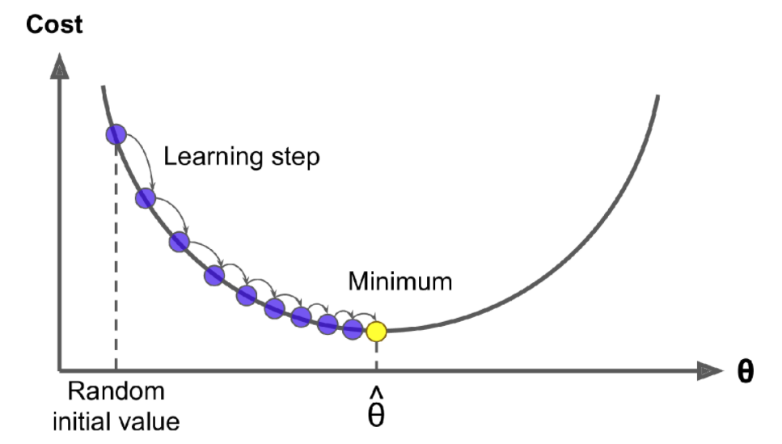

# Gradient Descent
  
  
Gradient descent measures the local gradient of the error function with regards to the parameter vector θ, and it goes in the direction of descending gradient. Once the gradient
is zero, you have reached a minimum!

An important parameter in Gradient Descent is the size of the steps, determined by the learning rate hyperparameter. If the learning rate is too small, the algorithm will have to go through many iterations to converge. However, if the learning rate is too high, you might end up on the other side, possibly even higher up than you were before.
  

