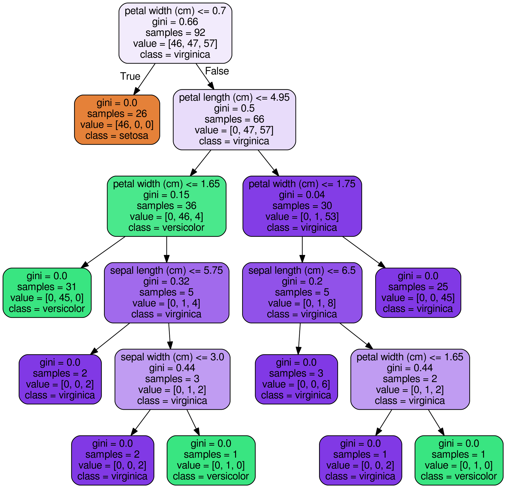

# Decision Trees  

  

Decision Trees are flowchart-like tree structures of all the possible solutions to a decision, based on certain conditions. It is called a decision tree as it starts from a root and then branches off to a number of decisions just like a tree.

The tree starts from the root node where the most important attribute is placed. The branches represent a part of entire decision and each leaf node holds the outcome of the decision.

### Attribute Selection Measure

The best attribute or feature is selected using the Attribute Selection Measure(ASM). The attribute selected is the root node feature.

Attribute selection measure is a technique used for the selecting best attribute for discrimination among tuples. It gives rank to each attribute and the best attribute is selected as splitting criterion.

The most popular methods of selection are:
1. Entropy
2. Information Gain
3. Gain Ratio
4. Gini Index

For this project I have used the Gini Index. Gini index is also type of criterion that helps us to calculate information gain. It measures the impurity of the node and is calculated for binary values only.

Reference: https://www.askpython.com/python/examples/decision-trees