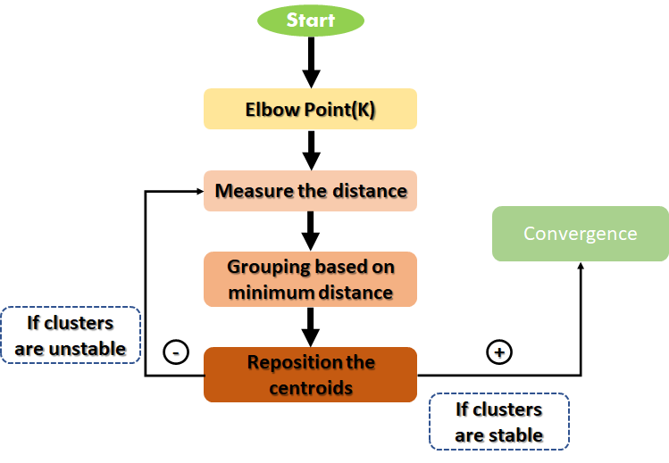

# k-Means Clustering

K-means clustering is a simple and elegant approach for partitioning a data set into K distinct, nonoverlapping clusters. To perform K-means clustering, we must first specify the desired number of clusters K; then, the K-means algorithm will assign each observation to exactly one of the K clusters.  

K-Means clustering is an unsupervised learning algorithm. There is no labelled data for this clustering, unlike in supervised learning. K-Means performs the division of objects into clusters that share similarities and are dissimilar to the objects belonging to another cluster.  
The term ‘K’ is a number. You need to tell the system how many clusters you need to create. For example, K = 2 refers to two clusters. There is a way of finding out the best or optimum value of K for a given data.  

K is a hyperparameter to the K-means Algorithm. In most cases, the number of clusters K  is determined in a heuristic fashion. Most strategies involve running K-means with different K–me values and finding the best value using some criterion. The two most popular criteria used are the elbow and the silhouette methods.  

### Elbow Method

The elbow method involves finding a metric to evaluate how good a clustering outcome is for various values of K and finding the elbow point. Initially, the quality of clustering improves rapidly when changing the value of K but eventually stabilizes. The elbow point is the point where the relative improvement is not very high anymore.  

### Silhouette Method

One of the fundamental steps of an unsupervised learning algorithm is to determine the number of clusters into which the data may be divided. The silhouette algorithm is one of the many algorithms to determine the optimal number of clusters for an unsupervised learning technique.

We assume that the data has already been clustered into k clusters in the Silhouette algorithm by a clustering technique. Then for each data point, we define the following:-

C(i) – The cluster assigned to the ith data point

|C(i)| – The number of data points in the cluster assigned to the ith data point

a(i) – It gives a measure of how well assigned the ith data point is to its cluster

b(i) – It is defined as the average dissimilarity to the closest cluster, which is not its cluster  

### Advantages of Algorithm:
- It is a step-wise representation of a solution to a given problem, which makes it easy to understand.
- An algorithm uses a definite procedure.
- It is not dependent on any programming language, so it is easy to understand for anyone, even without programming knowledge.
- Every step in an algorithm has its logical sequence, so it is easy to debug.
- By using the Algorithm, the problem is broken down into smaller pieces or steps; hence, it is easier for programmers to convert it into an actual program.
### Disadvantages of Algorithm:
- The Algorithm is Time-consuming.
- Difficult to show Branching and Looping in Algorithms.
- Big tasks are difficult to put in Algorithms.
